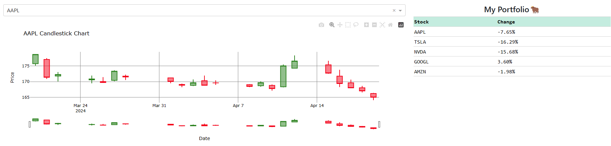

# 4003final_project
[Link](https://four003final-project.onrender.com)

## Overview

This stock trading dashboard provides real-time insights into stock performances using interactive charts and tables. Built with Python using Dash and Plotly, it serves as a practical application of data science and software engineering to financial data analysis.

## Features

- **Interactive Stock Charts**: Displays candlestick charts for selected stocks, which are interactive and provide detailed visual insights into stock prices over time.
- **Dynamic Stock Tables**: Showcases tables listing stocks within a portfolio and a watchlist, with real-time updates on percentage changes in stock prices.
- **Synchronized Data Updates**: Changes in the selected time interval or stock selection in one component automatically update all related components.
- **Responsive Layout**: Designed with a mobile-first approach, ensuring accessibility on various devices.

## Data Science Concepts Utilized

- **Time Series Analysis**: Used to understand stock price trends over selected time intervals.
- **Data Visualization**: Implemented using Plotly for creating interactive, high-quality charts.
- **Statistical Analysis**: Basic statistical concepts such as percentage change are employed to summarize stock price movements.
- **Data Fetching and Transformation**: Leveraged `yfinance` to fetch historical stock data and Pandas for data manipulation.

## Tools and Libraries Used

- **Dash**: A Python web application framework ideal for building analytical web applications.
- **Plotly**: For interactive, publication-quality graphs online.
- **Pandas**: Essential for data manipulation and analysis.
- **yfinance**: To fetch live stock data from Yahoo Finance.
- **Bootstrap**: Utilized via `dash-bootstrap-components` for responsive layouts.

## Strengths and Learning Experiences

- **Integration of Live Data**: Learning to integrate live financial data from Yahoo Finance using `yfinance` was instrumental in understanding how data can be fetched and processed in real-time applications.
- **Responsive Web Design**: Employing Bootstrap within Dash applications improved my skills in making responsive web applications that function well across different device sizes.
- **Advanced Interactive Visualizations**: The process honed my skills in creating and customizing interactive visualizations using Plotly, which is crucial for data science projects that rely heavily on data interpretation through visual means.
- **Callback Optimization**: Understanding and implementing efficient Dash callbacks to handle component interactions without performance lag was a critical learning curve that deepened my appreciation for backend processing in web apps.
- **Error Handling and Debugging**: The development process involved rigorous debugging, especially related to asynchronous data updates and managing state with callbacks, which enhanced my problem-solving skills.

## Challenges Overcome

- **Managing State with Callbacks**: Ensuring that the dashboard components update consistently and correctly based on user interactions required careful management of Dash callbacks and component states.
    - Example: these graphs are synced:
    - 
- **Performance Optimization**: Initially, the dashboard experienced lags due to inefficient data handling and excessive callback triggers. Optimizing these callbacks and the data fetching process significantly improved the responsiveness.
- **Responsive Design**: Integrating Bootstrap with Dash initially presented challenges in aligning components as desired, especially when aiming for a clean, professional look across devices.

## Future Enhancements

- **Extended Stock Metrics**: Incorporating more comprehensive analytics, including volatility indices and predictive models, to provide deeper insights.
- **User Accounts and Customization**: Allowing users to create accounts and customize their watchlist and portfolio.
- **Integration with Trading Platforms**: Providing options to directly trade stocks through the dashboard by integrating with trading APIs.

## Conclusion

Building this stock trading dashboard not only reinforced my data science and web development skills but also provided a practical framework for applying these skills in financial analytics. This project is a testament to the power of combining data science with full-stack development to create functional, user-friendly applications that can impact real-world financial decisions.
